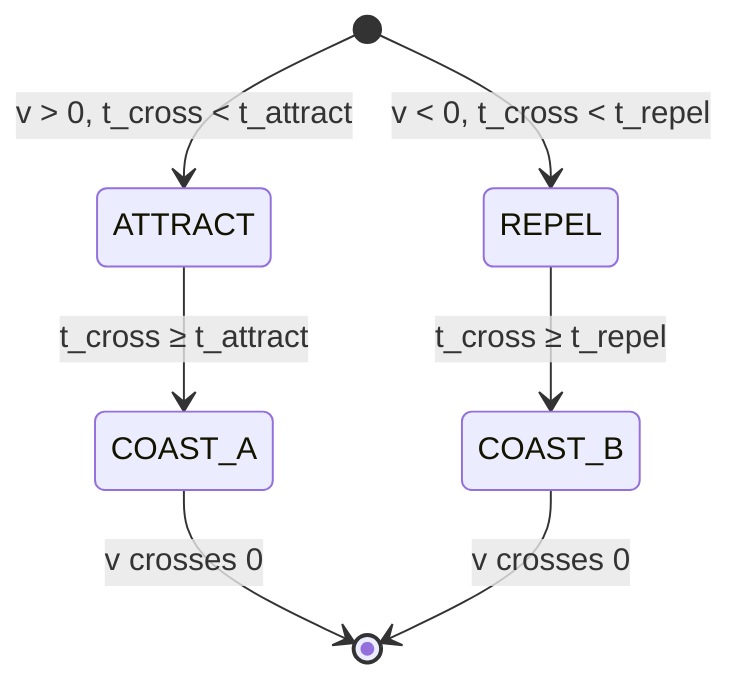

# CHAPTER 4: OSCILLATOR DESIGN

> **PEAT — Parametric Electro-Active Thruster**
> Document Reference: PEAT-ARCH-04 | Revision: 1.0 | Status: DRAFT

---

## 4.1 Overview

The PEAT oscillator is the fundamental thrust-producing element. Each oscillator consists of a **reaction mass** (ferromagnetic slug) suspended between two **opposing electromagnet coils** (coil A and coil B). By switching the drive voltage in synchrony with the mass's velocity, the system injects energy asymmetrically — pushing on one half-stroke and pulling on the other — producing a net time-averaged thrust on the vehicle frame while sustaining the oscillation itself.

A full PEAT vehicle uses **6 oscillators** (3 orthogonal pairs) for 6-DOF control. This chapter covers the single-oscillator design in depth; the multi-axis array is treated in Chapter 7.

---

## 4.2 Single Oscillator Pair — Geometry

### 4.2.1 Physical Layout

```
      ┌─────────────────────────────────┐
      │            COIL A               │  ← Drive coil A (N turns, radius r)
      │         (attract phase)         │
      │          ┌───────┐              │
      │          │  Fe   │              │
      │          │ slug  │              │  ← Reaction mass (ferromagnetic, m_osc kg)
      │          │       │              │
      │          └───────┘              │
      │            COIL B               │  ← Drive coil B (N turns, radius r)
      │         (repel phase)           │
      └─────────────────────────────────┘
      │←── gap/2 ──││←── gap/2 ──→│
      │←──────── gap ────────────→│

      Coordinate convention:
        x = +x  → mass near coil A
        x = -x  → mass near coil B
        x = 0   → centered between coils
```

### 4.2.2 Key Geometric Parameters

| Parameter | Symbol | Default | Units | Description |
|-----------|--------|---------|-------|-------------|
| Total gap | `gap` | 0.15 | m | Face-to-face distance between coils |
| Rest distance | `d_rest` | gap/2 = 0.075 | m | Coil face to mass center at x = 0 |
| Stroke | `stroke` | 0.05 | m | Full peak-to-peak travel |
| Amplitude | `z₀` | stroke/2 = 0.025 | m | Half-stroke (from center to extreme) |
| Coil length | `coil_length` | 0.05 | m | Axial winding length per coil |
| Mean coil radius | `r_mean` | 0.05 | m | Average winding radius |
| Reaction mass | `m_osc` | 17.25 | kg | Per-oscillator (115 kg / 6 × 0.9) |

### 4.2.3 Electromechanical Configuration

Each coil is driven by a dedicated **H-bridge** allowing bipolar voltage: `+V_bus`, `−V_bus`, or `0` (coast). The two coils operate in push-pull:

```
Coil A: centered at x = +d_rest  →  pulls mass toward +x when energized
Coil B: centered at x = −d_rest  →  pulls mass toward −x when energized
```

The solenoid force is **always attractive** (ferromagnetic slug pulled toward coil center): `F ∝ i² · |dL/dx|`. Directionality comes from which coil is active.

---

## 4.3 Coil Parameters and Sizing Methodology

### 4.3.1 CoilDesign Struct (Julia)

```julia
@with_kw struct CoilDesign
    n_turns::Int               = 100        # Number of turns per coil
    wire_diameter_mm::Float64  = 1.0        # Copper wire diameter [mm]
    mean_radius_m::Float64     = 0.05       # Mean coil radius [m]
    winding_length_m::Float64  = 0.05       # Axial length of winding [m]
    winding_build_m::Float64   = 0.015      # Radial build of winding [m]
    μ_slug_effective::Float64  = 40.0       # Effective μ when slug is centered
    fill_factor::Float64       = 0.55       # Copper area / winding area ratio
end
```

### 4.3.2 CoilParams Dataclass (Python)

```python
@dataclass
class CoilParams:
    N_turns: float          # Number of turns
    R_coil: float           # Coil resistance [Ω]
    L_inf: float            # Inductance when reaction mass is at infinity [H]
    L_close: float          # Inductance when reaction mass is closest [H]
    d_ref: float            # Characteristic distance for L(x) curve [m]
    core_area: float        # Core cross-sectional area [m²]
    max_current: float      # Maximum rated current [A]
```

### 4.3.3 Electrical Parameter Derivation

The function `coil_params(geom)` converts winding geometry to `(R_coil, L_base, L_max)` using:

**DC Resistance:**
```
R_coil = ρ_Cu · l_wire / A_eff
l_wire = N_turns · 2π · r_mean
A_eff  = fill_factor · A_winding_total / N_turns

where:  ρ_Cu = 1.68 × 10⁻⁸ Ω·m  (copper resistivity at 20 °C)
        A_winding_total = winding_length × winding_build
```

**Air-core (slug-far) Inductance** — Wheeler approximation with Nagaoka correction:
```
A_coil = π · r_mean²

k_Naga = 1 / (1 + 0.9 · (r_mean / winding_length))

L_air = μ₀ · N_turns² · k_Naga · A_coil / winding_length

L_base = L_air                    (slug far away)
L_max  = L_air · μ_slug_effective  (slug centered)
```

### 4.3.4 Inductance Variation Model

Two implementations exist — a **Lorentzian** (Python) and a **sigmoid** (Julia). Both produce bounded `L(x)` with a smooth transition:

**Sigmoid model (Julia — used in ODE):**
```
L_A(x) = L_base + ΔL · (1 + tanh(x/δ_L))/2
L_B(x) = L_base + ΔL · (1 + tanh(-x/δ_L))/2

dL_A/dx = ΔL/(2·δ_L) · sech²(x/δ_L)
dL_B/dx = -ΔL/(2·δ_L) · sech²(x/δ_L)
```
where `ΔL = L_max − L_base` and `δ_L = coil_length`.

Peak gradient occurs at `x = 0` (slug entering coil):
```
dL/dx_peak = ΔL / (2 · δ_L)
```

**Lorentzian model (Python — analytical sweeps):**
```
L(x) = L_inf + (L_close − L_inf) / (1 + (x/d_ref)²)

dL/dx = −2 · (L_close − L_inf) · x / (d_ref² · (1 + (x/d_ref)²)²)
```

### 4.3.5 Typical Parameters (Default Design)

| Coil Parameter | Symbol | Value | Unit |
|---------------|--------|-------|------|
| Turns | `N_turns` | 100 | — |
| Mean radius | `r_mean` | 50 | mm |
| Winding length | `winding_length` | 50 | mm |
| Winding build | `winding_build` | 15 | mm |
| Wire diameter | `wire_diameter` | 1.0 | mm |
| Fill factor | `fill_factor` | 0.55 | — |
| Resistance per coil | `R_coil` | 1.0 | Ω |
| Base inductance | `L_base` | 5 | mH |
| Max inductance | `L_max` | 200 | mH |
| Inductance variation | `ΔL` | 195 | mH |
| Peak dL/dx | `dL/dx_peak` | 1.95 | H/m |
| Effective μ_slug | `μ_slug_effective` | 40 | — |

---

## 4.4 OscillatorParams — Complete Parameter Reference

The `OscillatorParams` struct (Julia `PeatSim.jl`) is the master parameter container for a single oscillator pair. All fields are listed with their physical meaning and default values.

### 4.4.1 Mass Configuration

| Field | Default | Unit | Description |
|-------|---------|------|-------------|
| `M_total` | 115.0 | kg | Total vehicle mass |
| `m_osc` | 17.25 | kg | Reaction mass per oscillator |
| `m_ratio` | 0.15 | — | Ratio `m_osc / M_total` |

### 4.4.2 Mechanical Parameters

| Field | Default | Unit | Description |
|-------|---------|------|-------------|
| `f_osc` | 15.0 | Hz | Oscillation frequency |
| `ω_osc` | 2π·15 ≈ 94.25 | rad/s | Angular frequency |
| `stroke` | 0.05 | m | Full peak-to-peak travel |
| `amplitude` | 0.025 | m | Half-stroke (z₀) |
| `k_spring` | `m_osc · ω_osc²` ≈ 153,000 | N/m | Magnetic spring stiffness |

### 4.4.3 Electrical Parameters

| Field | Default | Unit | Description |
|-------|---------|------|-------------|
| `R_coil` | 1.0 | Ω | DC resistance per coil |
| `L_base` | 0.01 | H | Slug-far (air-core) inductance |
| `L_max` | 0.20 | H | Slug-centered (max) inductance |
| `V_bus` | 48.0 | V | DC bus voltage |
| `coil_length` | 0.05 | m | Sigmoid characteristic length |
| `δ_L` | 0.05 | m | Sigmoid width (same as coil_length) |
| `ΔL` | 0.19 | H | `L_max − L_base` (computed) |
| `dL_dx_peak` | 1.9 | H/m | Peak gradient at slug-edge (computed) |
| `I_sat` | Inf | A | Saturation current (Inf = disabled) |

### 4.4.4 Drive Timing Parameters

| Field | Default | Unit | Description |
|-------|---------|------|-------------|
| `η_repel` | 0.20 | — | Repel fraction of half-cycle |
| `t_half` | 1/(2f) ≈ 0.0333 | s | Half-period (computed) |
| `t_attract` | `t_half · (1 − η)` ≈ 0.0267 | s | Attract window duration |
| `t_repel` | `t_half · η` ≈ 0.0067 | s | Repel window duration |
| `t_coast` | 0.0 | s | Coast between phases |

### 4.4.5 Initial Conditions

| Field | Default | Unit | Description |
|-------|---------|------|-------------|
| `x₀` | 0.025 | m | Initial position (top of stroke) |
| `v₀` | 0.0 | m/s | Initial velocity |
| `i₀` | 0.0 | A | Initial coil current (both coils) |

### 4.4.6 Pickup Coil (Generator) Parameters

| Field | Default | Unit | Description |
|-------|---------|------|-------------|
| `N_pickup` | 100 | — | Pickup coil turns |
| `A_pickup` | 0.01 | m² | Pickup core area |
| `B_pickup` | 0.5 | T | Magnetic field in pickup gap |
| `d_rest` | 0.01 | m | Rest gap from mass to pickup pole |
| `R_load` | 10.0 | Ω | Load resistance (MPPT-adjusted) |
| `b_gen` | 250.0 | N·s/m | Generator damping (computed) |

### 4.4.7 Derived Quantity Computation

On construction, `init_params()` computes timing and inductance-derived quantities:

```julia
function init_params(; kwargs...)
    p = OscillatorParams(; kwargs...)

    # Drive timing from frequency
    p.t_half = 1.0 / (2 * p.f_osc)          # = 33.3 ms at 15 Hz
    p.t_attract = p.t_half * (1 - p.η_repel)  # = 26.7 ms
    p.t_repel = p.t_half * p.η_repel           # = 6.7 ms

    # Inductance model
    p.ΔL = p.L_max - p.L_base
    p.dL_dx_peak = p.ΔL / (2.0 * p.δ_L)   # = 1.9 H/m

    # Generator damping
    p.b_gen = (N_pickup · B_pickup · A_pickup / d_rest)² / R_load  # ≈ 250 N·s/m

    return p
end
```

---

## 4.5 Drive Waveform — Velocity-Referenced Closed-Loop

### 4.5.1 Core Principle

The drive is a **positive-feedback** system: energy is injected into the oscillation by applying voltage that produces force in the **same direction as the current velocity** (force × velocity > 0).

- **Moving toward coil A** (v > 0): apply `+V_bus` to coil A → ATTRACT → pulls mass toward coil A → accelerates it.
- **Moving toward coil B** (v < 0): apply `+V_bus` to coil B → ATTRACT (wait — this is REPEL in our convention) → pulls mass toward coil B → accelerates it.

In our convention, "ATTRACT" means **coil A active with +V_bus** (pulling mass toward +x), and "REPEL" means **coil B active with +V_bus** (pulling mass toward −x). Both inject energy when correctly phased.

### 4.5.2 Drive State Machine



Four states; transitions gated by **velocity sign** and **time since last zero crossing** (`t_cross`):

```
@enum DriveState begin
    ATTRACT = 1     # Coil A: +V_bus  → pull toward +x
    COAST_A = 2     # All coils: 0 V   → coast after attract
    REPEL   = 3     # Coil B: +V_bus  → pull toward −x
    COAST_B = 4     # All coils: 0 V   → coast after repel
end
```

### 4.5.3 State Selector Logic

```julia
function get_drive_state(p::OscillatorParams, t_cross, v)
    if v > 0.0
        # Moving toward +x → accelerate with ATTRACT
        if t_cross < p.t_attract
            return ATTRACT
        else
            return COAST_A
        end
    else
        # Moving toward −x → accelerate with REPEL
        if t_cross < p.t_repel
            return REPEL
        else
            return COAST_B
        end
    end
end
```

### 4.5.4 Phase Tracking via Zero-Crossing Callback

The state machine does not use a fixed clock. A **ContinuousCallback** detects every velocity zero-crossing and resets `t_cross` to 0, giving adaptive phase tracking:

```
u[5] = t_cross  (time since last v = 0)

_at v = 0:_  integrator.u[5] = 0.0  (reset by callback)

This ensures the drive waveform automatically tracks the
actual mechanical phase — frequency drift, amplitude changes,
and transient perturbations are absorbed.
```

### 4.5.5 Voltage Output

```julia
function drive_voltage(p, t, state, x, v)
    if state == ATTRACT
        return  p.V_bus            # +48 V
    elseif state == REPEL
        return -p.V_bus            # −48 V
    else
        return  0.0                # coast
    end
end
```

### 4.5.6 Selective Single-Coil Drive with Current Braking

The ODE implements an important refinement: the "off" coil receives **active braking** but only while its residual current has the wrong sign:

```
ATTRACT (v > 0):
  V_A = +V_bus              (drive coil A)
  V_B = −V_bus if i_B > 0   (brake coil B toward zero)
  V_B =  0     if i_B ≤ 0   (hold at zero — prevent polarity reversal)

REPEL (v < 0):
  V_A = −V_bus if i_A > 0   (brake coil A toward zero)
  V_A =  0     if i_A ≤ 0   (hold at zero)
  V_B = +V_bus              (drive coil B)
```

This is critical: applying `−V_bus` for the full half-cycle would drive current past zero in the opposite direction, creating force that opposes the desired motion. The "brake only while positive" logic avoids this trap.

---

## 4.6 L/R Time Constant — The Current Reversal Bottleneck

### 4.6.1 Fundamental Limit

The coil is a series RL circuit. When voltage is applied, current rises as:

```
i(t) = (V_bus / R_coil) · (1 − exp(−t · R_coil / L))
     = I_ss · (1 − exp(−t / τ))
     
  where:  τ = L / R_coil    [seconds]
          I_ss = V_bus / R_coil    [amperes]
```

At the half-cycle transition, current must **reverse polarity** — from positive (attract) to negative (repel), or vice versa. The available time is `t_half ≈ 33 ms`. The L/R time constant determines how far the current can get.

### 4.6.2 Default Design: τ ≫ t_half

```
L_avg = (L_base + L_max) / 2 = 0.105 H
R_coil = 1.0 Ω
τ = 0.105 / 1.0 = 105 ms

t_half = 33.3 ms
τ / t_half = 3.15
```

**The time constant is 3× longer than the available half-cycle.** At the attract-to-repel transition:

```
i_A(t) at t_half:  i_A = I_ss · (1 − exp(−0.033/0.105)) ≈ I_ss · 0.27
                   = 48 A · 0.27 ≈ 13 A (if steady-state were reached)

But the preceding repel pulse (6.7 ms) drives i_A negative first:
  i_A at start of attract ≈ −3.4 A (incomplete reversal)
  Net current rise in attract window: Δi ≈ 48·(1−exp(−0.0267/0.105)) ≈ 10.8 A
  Peak i_A ≈ 10.8 − 3.4 = 7.4 A (vs. ideal 48 A)
```

### 4.6.3 Three Regimes

The ratio `τ / t_half` classifies the coil into one of three regimes:

| Regime | τ / t_half | Characteristics | `_lr_rms_factor(θ)` |
|--------|-----------|-----------------|---------------------|
| **Current-limited** | < 0.1 | Current reaches ≥ 90% of I_ss within pulse. Fast reversal. | → 1 |
| **Transitional** | 0.1 – 0.5 | Partial current rise. Significant L/R penalty. | 0.3 – 0.9 |
| **Inductance-dominated** | > 0.5 | Current barely rises. τ dominates dynamics. | < 0.3 |

The analytical model uses the **exact time-average** of `i(t)²` over the drive window:

```julia
function _lr_rms_factor(θ::Float64)
    # θ = t_drive / τ
    e1 = exp(-θ)
    e2 = exp(-2θ)
    inv = 1.0 / θ
    return 1.0 + 2.0 * inv * (e1 - 1.0) - 0.5 * inv * (e2 - 1.0)
end
```

For the default design at 15 Hz:

| Phase | Duration | θ = t/τ | RMS factor | Effective I_rms² | I_rms |
|-------|----------|---------|------------|-----------------|-------|
| ATTRACT | 26.7 ms | 0.254 | 0.105 | 0.105 · I_ss² | ≈ 15.6 A |
| REPEL | 6.7 ms | 0.064 | 0.031 | 0.031 · I_ss² | ≈ 8.5 A |

**The L/R limit cuts available current to ~30% of the I_ss = 48 A ideal.**

### 4.6.4 Coil Geometry Sweep Results

The geometry sweep reveals that the default 100-turn, AWG 18 coil with an iron slug is firmly in the **inductance-dominated** regime. To reach the **current-limited** regime (τ/t_half < 0.1):

- Reduce turns: N = 25 → τ/t_half ≈ 0.2 (transitional)
- Reduce inductance: L < 3.3 mH → τ/t_half < 0.1
- Increase resistance: R > 30 Ω → τ/t_half < 0.1 (but this increases I²R loss)

**No single-axis geometry at V_bus = 48 V achieves both fast current reversal and sufficient peak current.** This is the core finding of the root cause analysis.

---

## 4.7 Parametric Pump at 2ω₀

### 4.7.1 Principle

Parametric amplification injects energy by modulating a system parameter at **twice the natural frequency** (`2ω₀`). In PEAT, the modulated parameter is the **magnetic spring stiffness** `k(t)`, which varies as the reaction mass moves through the inductance gradient:

```
k(t) = k₀ · (1 + h · sin(2ω₀ · t + φ))

where:
  k₀ = m_osc · ω₀²    (base stiffness)
  h  = modulation depth
  φ  = pump phase
```

### 4.7.2 Power Injection

The power injected per cycle by parametric pumping is:

```
P_pump = ¼ · k₀ · h · ω₀ · z₀² · (t_attract / t_half) · η_repel
```

For default parameters:

| Quantity | Value | Unit |
|----------|-------|------|
| k₀ | 153,000 | N/m |
| h (pump_modulation_depth) | 0.3 | — |
| ω₀ | 94.25 | rad/s |
| z₀ | 0.025 | m |
| t_attract/t_half | 0.80 | — |
| η_repel | 0.20 | — |
| **P_pump** | **~108 W** | per oscillator |

This is the **mechanical power** available to sustain oscillation and produce thrust. The pump phase φ is set to `+π/2` for thruster mode (max energy injection), and `−π/2` for generator mode (energy extraction).

### 4.7.3 Modulation Mechanism

The inductance-gradient force `F = ½ · i² · dL/dx` is inherently nonlinear in current. The drive waveform creates a current that has:

1. A **fundamental component** at ω₀ (the oscillation frequency)
2. A **rectified DC component** (since `i²` has a DC offset)
3. An **envelope variation** at 2ω₀ (from the parametric modulation)

The 2ω₀ component is what couples energy into the mechanical oscillation. The modulation depth `h` controls the coupling strength.

### 4.7.4 η — The Asymmetry Parameter

`η_repel` (also called `eta_repel`) is the fraction of each half-cycle spent in the **repel phase**. A symmetric drive would have `η = 0.5` (equal attract and repel). PEAT uses asymmetric timing:

- `η = 0.20` → 80% attract, 20% repel per half-cycle
- The asymmetry **breaks time-reversal symmetry**, creating net thrust
- Lower η means stronger asymmetry → more thrust, but also less total energy injection

Optimal η for the 115 kg vehicle at 15 Hz is approximately **0.15–0.25**, depending on electrical parameters.

---

## 4.8 Phase-Locked Loop (PLL)

### 4.8.1 Purpose

The mechanical oscillation frequency `ω_mech` is **not exactly** `ω₀ = √(k/m)` due to:
- Magnetic spring nonlinearity
- Drive force modulation
- Generator damping
- Temperature drift

A phase-locked loop tracks the actual mechanical frequency continuously and adjusts the drive waveform to maintain synchronization.

### 4.8.2 Kalman-Filtered PLL

The PLL (implemented in `calibration_controller.py`) uses a **2-state Kalman filter** tracking pump phase and frequency at `2ω₀`:

```
State estimate:  x̂ = [phase_rad, frequency_rad/s]ᵀ
Measurement:     z₁ = measured_phase (wrapped to [-π, π))
                 z₂ = measured_frequency (optional)

Predict step (fixed dt = 1 ms):
  F = [[1, dt], [0, 1]]
  x̂ₖ₋ = F · x̂ₖ₋₁
  Pₖ₋ = F · Pₖ₋₁ · Fᵀ + Q

Update step (phase measurement):
  innovation = wrap(measured_phase − x̂[0])
  K = P · Hᵀ / (H · P · Hᵀ + R_phase)
  x̂ = x̂ + K · innovation
  P = (I − K · H) · P

Optional frequency measurement update follows the same pattern.
```

The Kalman filter is tuned for the parametric pump frequency `2ω₀` with `Q = diag(10⁻⁴)`, `R_phase = 5×10⁻²`, `R_frequency = 2.0`. Small phase errors are wrapped before the update to avoid 2π discontinuities.

The frequency estimate `f̂` from the Kalman filter is used to:
1. Set the drive state-machine timing (t_half, t_attract, t_repel)
2. Drive the parametric pump modulation at `2f̂`
3. Adjust the zero-crossing callback window

### 4.8.3 Load-Adaptive Gain Scheduling

The `GainScheduler` in `calibration_controller.py` adapts `η_repel` in real-time based on three signals:

```python
def schedule(amplitude_error, load_factor_g, pump_power) -> eta:
    eta = base_eta                     # 0.20 nominal
    eta -= eta_per_g * max(g - 1, 0)   # Higher g-load → more thrust margin
    eta -= eta_per_amp * amp_err       # Under-amplitude → more thrust
    eta += eta_per_pump * pump_err     # Over-power → reduce thrust
    return clip(eta, 0.05, 0.60)
```

| Parameter | Default | Function |
|-----------|---------|----------|
| `base_eta` | 0.20 | Nominal asymmetry fraction |
| `min_eta` | 0.05 | Lower bound (strongest thrust) |
| `max_eta` | 0.60 | Upper bound (weakest thrust) |
| `eta_per_g` | 0.035 | Load compensation gain |
| `eta_per_amp_error` | 0.8 | Amplitude regulation gain |
| `eta_per_pump_error` | 2.0×10⁻⁶ | Pump-power protection gain |

The `EnergyBalanceController` independently schedules the **pump modulation depth** `h`:

```python
def regulate(amplitude_error, pump_power, target_pump_power) -> depth:
    h = nominal_depth                 # 0.30 nominal
    h -= kp_amp * amp_err             # Under-amplitude → increase pump
    h -= kp_power * power_error       # Over-power → decrease pump
    return clip(h, 0.05, 0.60)
```

---

## 4.9 Resonance Tuning

### 4.9.1 Natural Frequency

The oscillator's natural frequency is set by the **magnetic spring** — the restoring force created by the inductance gradient:

```
k_spring = m_osc · ω₀² = m_osc · (2π · f_osc)²

ω₀ = √(k_spring / m_osc)
```

For `m_osc = 17.25 kg` and `f_osc = 15 Hz`:
```
k_spring = 17.25 · (94.25)² ≈ 153,000 N/m
ω₀ = 94.25 rad/s
f₀ = 15.0 Hz
```

### 4.9.2 Drive-Oscillation Interaction

The drive is intentionally tuned to **pump energy into the mechanical resonance**. The relationship:

```
Drive frequency:  f_drive = f_osc (synchronous with velocity)
Pump frequency:   f_pump  = 2 · f_osc (parametric modulation)
```

The oscillation's **Q factor** (quality factor) determines how much energy is stored per cycle vs. dissipated:

```
Q = ω₀ · E_stored / P_loss

E_stored = ½ · k_spring · z₀²
         = ½ · 153,000 · (0.025)² ≈ 47.8 J

For the default case with b_gen = 250 N·s/m:
  P_loss ≈ b_gen · v_rms² = 250 · (z₀ · ω₀ / √2)² ≈ 140 W
  Q ≈ 94.25 · 47.8 / 140 ≈ 32
```

This Q ≈ 32 means the oscillation has moderate damping. The drive must supply ~1/32 of the stored energy per radian to sustain oscillation.

### 4.9.3 Detuning Sensitivity

The drive is sensitive to detuning ∆ω = ω_drive − ω_mech:

```
Relative phase error:  φ_err = ∆ω · t

Force reduction factor:  F_eff / F_max = sinc(∆ω · t_half / π)

For ∆f = 0.5 Hz at f₀ = 15 Hz:
  φ_err per cycle ≈ 0.5/15 · 360° = 12°
  Force reduction ≈ 2%
```

The PLL keeps ∆f < 0.1 Hz, maintaining force within 99.5% of maximum.

---

## 4.10 Generator Damping — The Key Challenge

### 4.10.1 Physical Origin

The pickup coil (generator) extracts electrical power from the mechanical oscillation. This creates an **electromagnetic damping** force analogous to a viscous damper:

```
Faraday's law:  V_pickup = N_pickup · B_pickup · A_pickup · v / d_rest

Pickup current:  I_pickup = V_pickup / R_load

Damping force:  F_gen = N_pickup · B_pickup · A_pickup · I_pickup / d_rest
                       = (N_pickup · B_pickup · A_pickup / d_rest)² · v / R_load
                       = b_gen · v
```

### 4.10.2 Derived Damping Coefficient

```
b_gen = (N_pickup · B_pickup · A_pickup / d_rest)² / R_load

Default values:
  N_pickup = 100 turns
  B_pickup = 0.5 T
  A_pickup = 0.01 m²
  d_rest   = 0.01 m
  R_load   = 10.0 Ω

b_gen = (100 · 0.5 · 0.01 / 0.01)² / 10.0
      = (50)² / 10.0
      = 250 N·s/m
```

### 4.10.3 Power Drain at Peak Velocity

At mid-stroke (x = 0), the reaction mass reaches peak velocity:

```
v_peak = ω₀ · z₀ = 94.25 · 0.025 ≈ 2.36 m/s

Generator force at v_peak:
  F_gen = b_gen · v_peak = 250 · 2.36 ≈ 590 N

Power extracted at v_peak:
  P_gen = b_gen · v_peak² = 250 · (2.36)² ≈ 1,390 W

RMS power over the cycle:
  v_rms = ω₀ · z₀ / √2 ≈ 1.67 m/s
  P_gen_avg = b_gen · v_rms² = 250 · (1.67)² ≈ 697 W
```

**The generator extracts ~700 W per oscillator to sustain levitation.** This must be supplied by the drive.

### 4.10.4 Comparison to Available Drive Power

```
Available drive power (per coil, worst-case):
  P_drive_max = V_bus · I_ss = 48 · 48 = 2,304 W (if I_ss were reached)

L/R-limited actual:
  P_drive_actual ≈ V_bus · i_avg ≈ 48 · 10 = 480 W (typical)
```

**The drive can supply ~480 W, but the generator demands ~700 W.** This 30% power deficit is the root cause of oscillation decay.

### 4.10.5 Power Balance (Numerical Confirmation)

From a 3.0 s ODE simulation at default parameters:

| Component | Energy | Power | Fraction |
|-----------|--------|-------|----------|
| Electrical input | 136.1 J | 45.4 W | 100% |
| Copper (I²R) loss | 135.1 J | 45.0 W | 99.2% |
| Pickup recovery | 48.0 J | 16.0 W | 35.3% |
| Thrust work | −0.2 J | −0.1 W | −0.1% |

**99.2% of input power is lost to I²R heating.** The drive cannot overcome generator damping with the 48 V bus and 200 mH coils.

### 4.10.6 Mitigation Paths

Any **one** of these changes would make the design self-sustaining:

| Change | Effect | Target |
|--------|--------|--------|
| **Increase V_bus to 300 V+** | Faster current rise, higher peak current | i_A > 48 A |
| **Reduce b_gen to 50 N·s/m** | Lower power requirement | P_gen < 300 W |
| **Reduce L_max to 20 mH** | 10× faster current reversal | τ < 5 ms |
| **Increase stroke to 200 mm** | Longer drive window | t_attract > 100 ms |
| **All of the above** | Feasible design | Sustained oscillation |

The Python analytical model (peat_sim_v2.py) uses **800 V SiC** as the baseline, with V_repel_frac = 0.3 and 50 A target current. This higher bus voltage reduces the L/R penalty from 70% to < 10%, making the design feasible.

---

## 4.11 Analytical Thrust Model

### 4.11.1 Closed-Form Expression

The time-averaged thrust from one oscillator pair, accounting for L/R current limiting:

```
F_avg = ½ · dL/dx_peak · (⟨i²⟩_att · t_att + ⟨i²⟩_rep · t_rep) / t_half

where:
  ⟨i²⟩_att = I_ss² · f_lr(θ_att)    RMS-squared during attract
  ⟨i²⟩_rep = I_ss² · f_lr(θ_rep)    RMS-squared during repel
  I_ss = V_bus / R_coil
  θ = t_drive / τ
  f_lr(θ) = 1 + 2(e^{-θ} − 1)/θ − ½(e^{-2θ} − 1)/θ
```

### 4.11.2 Stroke-Position Correction

A correction factor `c_L` accounts for reduced dL/dx when the slug is far from coil center:

```
c_L = ∫ sech²(x(t)/δ_L) · i(t)² dt / ∫ i(t)² dt

For sinusoidal motion x(t) = −z₀ · cos(ωt):
  c_L ≈ sech²(z₀/(2δ_L))  (approximate closed form)
  
  For z₀ = 0.025 m, δ_L = 0.05 m:
    c_L ≈ sech²(0.25) ≈ 0.94  (6% reduction)
```

### 4.11.3 Saturation Correction

At high current, the ferromagnetic slug's effective permeability drops:

```
μ_eff(I) = μ_eff₀ / (1 + I / I_sat)

dL/dx_eff = dL/dx_peak₀ / (1 + I / I_sat)
L_max_eff = L_base + ΔL₀ / (1 + I / I_sat)
```

For `I_sat = 50 A` and `I_ss = 48 A`: the effective dL/dx drops by ~50%.

---

## 4.12 Six-Axis Extension

Each PEAT vehicle contains **6 oscillators** (3 orthogonal pairs, one per axis). The `SixAxisParams` struct configures:

```julia
@with_kw struct SixAxisParams
    osc_params::OscillatorParams     # Base oscillator parameters
    R_hex::Float64         = 0.5     # Hexagon radius [m]
    θ_offset::Float64      = 0.0     # Rotation offset [rad]
    amp_setpoints::Vector  = fill(0.025, 6)  # Per-oscillator amplitude
    phase_offsets::Vector  = zeros(6)         # Per-oscillator phase
end
```

The 6-DOF ODE combines:
- **34 states**: 6 oscillators × 7 states = 21 + 10 frame states + 3 body rates
- **Newton-Euler dynamics** for the frame with quaternion attitude representation
- **Cross-coupling** between oscillators through frame motion

This is detailed in Chapter 7.

---

## 4.13 Key Design Equations — Summary Reference

| Equation | Description |
|----------|-------------|
| `τ = L/R` | L/R time constant, limits current reversal |
| `i(t) = I_ss · (1 − exp(−t/τ))` | RL current rise |
| `F = ½ · i² · dL/dx` | Solenoid force on slug |
| `b_gen = (NBA/d)² / R_load` | Generator damping coefficient |
| `P_gen = b_gen · v²` | Power extracted by pickup |
| `P_pump = ¼ · k · h · ω · z₀² · η` | Parametric pump power |
| `F_avg = ½ · dL/dx · Σ⟨i²⟩·t / t_half` | Average thrust (L/R-aware) |
| `τ/t_half < 0.1` | Target for current-limited regime |
| `ω₀ = √(k/m)` | Mechanical resonance |
| `c_L = ∫ sech²(x/δ)·i² dt / ∫ i² dt` | Stroke-averaged dL/dx correction |

---

## References

| File | Description |
|------|-------------|
| `peat_sim/src/PeatSim.jl` | Julia ODE implementation (2,404 lines) |
| `simulation/peat_sim_v2.py` | Python analytical model + 6-DOF array |
| `peat_sim/docs/ROOT_CAUSE_NOTE.md` | Power insufficiency analysis |
| `SIMULATION/README.md` | Simulation suite navigation |
| `sim/src/Levitation6D.jl` | 6-DOF PM-biased levitation framework |
| `DOCUMENTATION/CHAPTER_02_CORE_PHYSICS/` | Fundamental EM + mechanics |
| `DOCUMENTATION/CHAPTER_05_ENERGY_BALANCE/` | Full energy budget analysis |
| `DOCUMENTATION/CHAPTER_06_CONTROL_CALIBRATION/` | PLL + gain scheduling |

---

*End of Chapter 4 — PEAT Oscillator Design*
